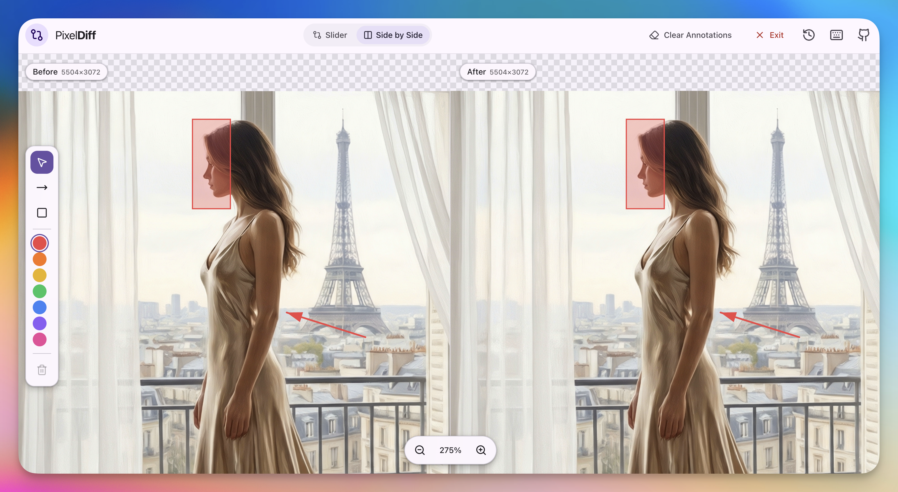

# PixelDiff

**Spot Every Difference, Pixel by Pixel**

A visual comparison tool for designers and developers to quickly identify differences between images and videos.

## Features

### Image Comparison
- **Slider Mode** - Drag the slider to reveal differences between two images
- **Side by Side Mode** - View both images simultaneously for direct comparison
- **Resolution Display** - Shows image dimensions for both before and after versions
- **Format Support** - PNG, JPG, WebP, GIF, SVG

### Video Comparison
- **Synchronized Playback** - Both videos play in perfect sync
- **Frame-by-Frame Navigation** - Step through videos one frame at a time
- **Playback Speed Control** - 0.5x, 1x, 2x speed options
- **Keyboard Shortcuts** - Space to play/pause, arrow keys to navigate

### Recent Comparisons
- **Quick Access** - Instantly reopen previous comparisons from history
- **Thumbnail Previews** - Visual preview of before/after for each comparison
- **Persistent Storage** - History survives browser refresh (Chrome/Edge)
- **Filter by Type** - Separate views for image and video comparisons

### Annotation Tools
- **Arrow Tool** - Point out specific areas of interest
- **Rectangle Tool** - Highlight regions for discussion
- **Color Options** - Multiple colors for different annotation purposes
- **Easy Selection** - Click to select and delete annotations
- **Clear Annotations** - Remove all annotations while keeping files loaded
- **Re-annotate** - Clear and start fresh without re-uploading files

### Navigation
- **Zoom** - Zoom in/out to inspect fine details
- **Pan** - Click and drag to move around the image/video
- **Keyboard Support** - Full keyboard navigation support

### Session Management
- **Exit** - Close current comparison and return to upload page
- **Clear Annotations** - Remove annotations without closing the comparison
- **Quick Re-compare** - Annotate multiple times without re-uploading files

## Use Cases

- **Design Review** - Compare design iterations and spot changes
- **QA Testing** - Verify UI implementations match designs
- **Version Control** - Visualize changes between file versions
- **Bug Reporting** - Annotate and document visual issues
- **Client Feedback** - Share annotated comparisons with stakeholders

## Getting Started

1. Choose between **Image** or **Video** mode
2. Upload your "Before" and "After" files
3. Use **Slider** or **Side by Side** view to compare
4. Add annotations to highlight differences
5. Navigate with zoom and pan for detailed inspection
6. Access recent comparisons from the history panel

## Keyboard Shortcuts

| Shortcut | Action |
|----------|--------|
| `Space` | Play/Pause (Video) |
| `←` / `→` | Previous/Next frame (Video) |
| `V` | Select tool |
| `A` | Arrow tool |
| `R` | Rectangle tool |
| `Delete` / `Backspace` | Delete selected annotation |

## Browser Support

- **Chrome** - Full support including history persistence
- **Edge** - Full support including history persistence
- Other browsers - Core features work, history may not persist

## License

MIT

## Star History

<a href="https://star-history.com/#DangJin/PixelDiff&Date">
 <picture>
   <source media="(prefers-color-scheme: dark)" srcset="https://api.star-history.com/svg?repos=DangJin/PixelDiff&type=Date&theme=dark" />
   <source media="(prefers-color-scheme: light)" srcset="https://api.star-history.com/svg?repos=DangJin/PixelDiff&type=Date" />
   
 </picture>
</a>

## Links

- [GitHub Repository](https://github.com/DangJin/PixelDiff)
